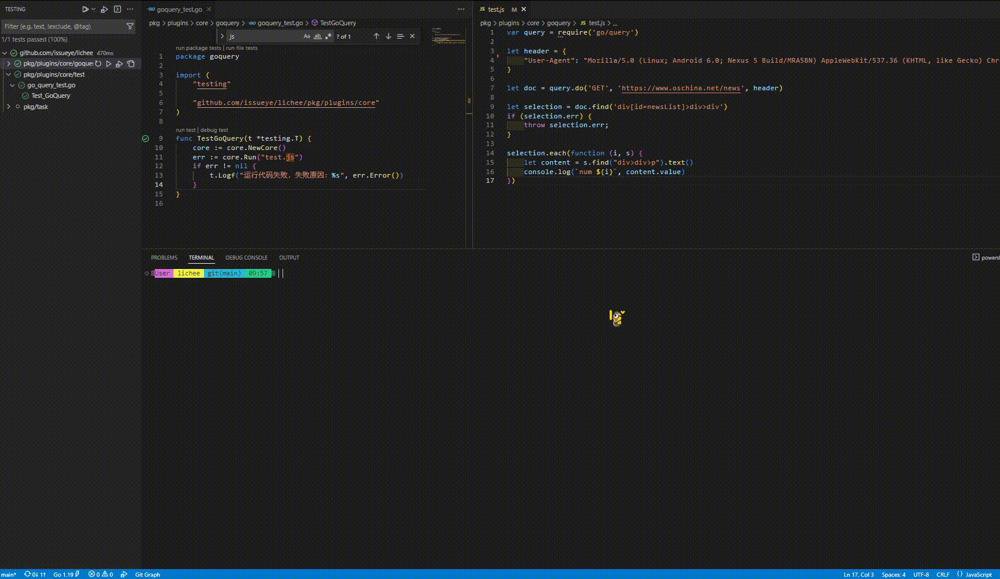
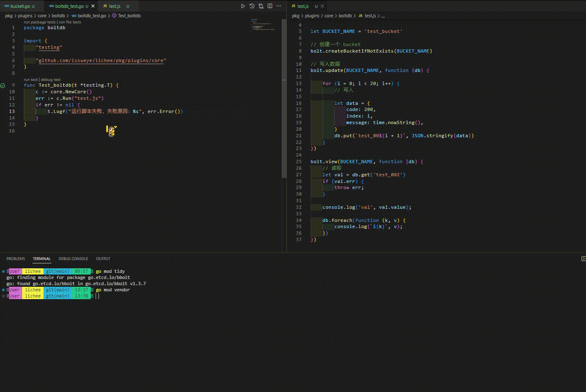

<div align="center">


# LICHEE ：一个运行 `javascript` 脚本的小工具

支持`javascript` 脚本执行、定时任务、`http server`

</div>

演示视频：

- 定时获取数据库内容


- 爬虫网页内容

  

- go-boltdb 数据库支持

  

## 配置文件

使用 `LICHEE` 需要先创建一个 `config.json`
的配置文件，在配置文件中添加中添加对应的配置信息

```json
{
  "local_port": 10066
}
```

- `local_port` 提供服务的端口号

## 提供的 `javascript` `api` 方法

- `path/filepath`
  - `abs`
  - `join`
  - `ext`
- `utils`
  - `print`
  - `panic`
  - `toString`
  - `toBase64`
  - `md5`
  - `sha1`
  - `arrayToMap`
- `types`
  - `newInt`
  - `intValue`
  - `newBool`
  - `boolValue`
  - `newString`
  - `stringValue`
  - `makeByteSlice`
  - `test`
  - `err`
  - `retUndefined`
  - `retNull`
- `time`
  - `sleep`
  - `nowString`
  - `nowDate`
  - `nowYear`
  - `nowMonth`
  - `nowDay`
  - `nowHour`
  - `nowMinute`
  - `nowSecond`
- `os`
  - `O_CREATE` `O_WRONLY` `O_RDONLY` `O_RDWR` `O_APPEND` `O_EXCL` `O_SYNC`
    `O_TRUNC`
  - `args`
  - `tempDir`
  - `hostname`
  - `getEnv`
  - `remove`
  - `removeAll`
  - `mkdir`
  - `mkdirAll`
  - `getwd`
  - `chdir`
  - `openFile`
  - `create`
  - `open`
  - `stat`
- `ini`
  - `create`
  - `getStr`
  - `getInt`
  - `getBool`
  - `getSection`
  - `setStr`
  - `setInt`
  - `setBool`
  - `save`
- `fmt`
  - `sprintf`
  - `printf`
  - `println`
  - `print`
- `file`
  - `write`
  - `read`
- `error`
  - `new`
- `db/local`
  - `query`
  - `exec`
  - `begin`
    - `commit`
    - `rollback`
    - `exec`
    - `query`
- `os/exec`
  - `command`
